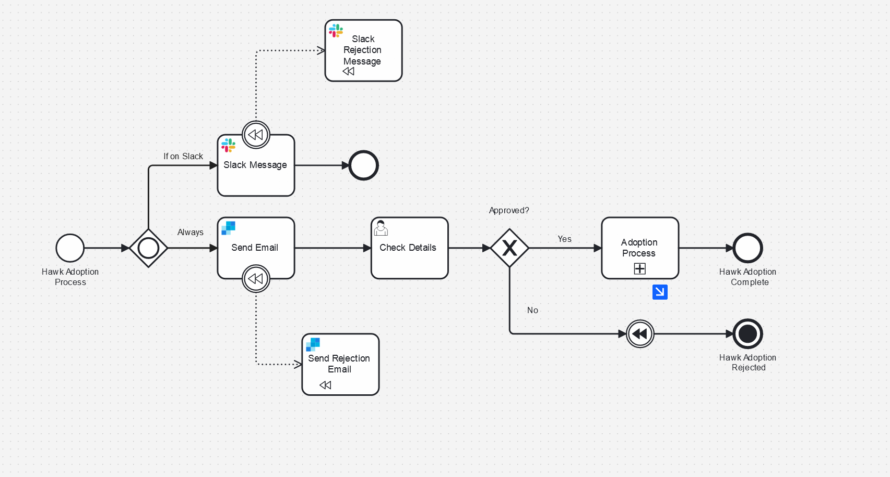

# Compensation Example Camunda 8

This is an example of how to implement a compensation events and tasks in order to undo something executed previously in a BPMN process

### Why Use Compensation

In event based distributed architecture you can't relay on rollbacks to undo actions that have been taken. Instead you have to actively trigger compensations. This solution is detiled conceptually as a the [Saga Pattern](https://microservices.io/patterns/data/saga.html). The best way to implement this pattern in Camunda is by using the compensation event in BPMN.  

### What The Process Does

In this process you can register to adopt a hawk - who wouldn't want a hawk?
Well in some cases we Send a Slack message and an Email. If there'ew not on slack we only send an email. 

If they get rejected - i throw a compensation event which will then send another message or email letting them know they don't get a hawk. 

### How to Run the Process

#### Setup Camunda
 You’ll need a Camunda 8 Cluster (the easiest place to do that is [Camunda SaaS](https://signup.camunda.com/accounts)). Then the fun can start.

Upload the bpmn model and the forms from their respective folders and add them to your Camunda 8 account. From the modeler you can deploy the process to a cluster.

Before running this you'll need to do a bit of setup.

You'll need to create an [API key for slack](https://api.slack.com/tutorials/tracks/getting-a-token) and setup a [SendGrid account](https://sendgrid.com/en-us) 

🔐 It’s important to know that it’s best practice not to simply copy and paste this sensitive information directly into the model but rather to create a secret for each of these in your Camunda cluster. Then you can reference it by typing {{secrete.yourSecreteHere}} followed by the name of the key you want to access.

For this example to work you'll need to create secretes with the following names:

    Slack
    SendGrid

Now you’re ready to start the process. Either from the modeler or from tasklist. 